# Azure DNS Private Resolver - MicroHack

### [Prerequistes](#prerequisites)

### [Challenge 1: Configure DNS Forwarding Ruleset](#challenge-1-configure-dns-forwarding-ruleset-1)

### [Challenge 2: DNS forwarding ruleset on spokes](#challenge-2-dns-forwarding-ruleset-on-spokes-1)

### [Challenge 3: Deploy Azure Firewall to get DNS logs](#challenge-3-deploy-azure-firewall-to-get-dns-logs-1)

# Prerequisites

## Overview

This Microhack purpose is to demonstrate the [Azure DNS Private resolver](https://docs.microsoft.com/en-gb/azure/dns/dns-private-resolver-overview) feature. A common architecture found around DNS setup between on-premise and Azure environments looks like

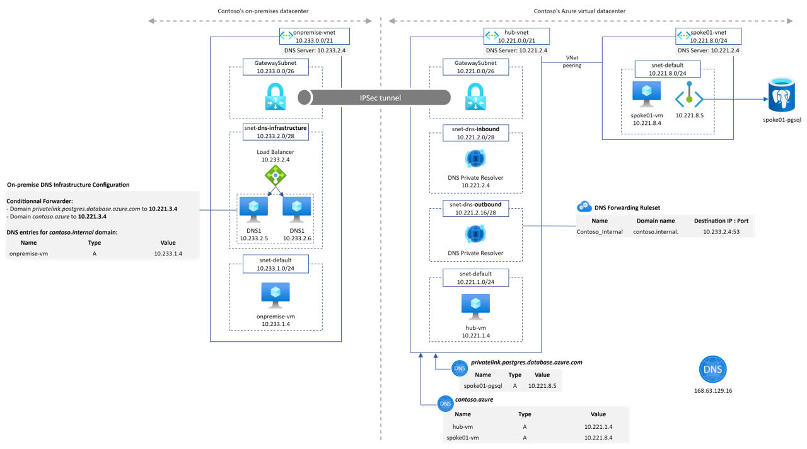

For this workshop, we'll emulate the on-premise part with an on-premise Vnet and Azure DNS Private resolver also as shown on the following diagram


In order to use the MicroHack time most effectively, the following tasks should be completed prior to starting the session.

In summary:
- Contoso's on-premise datacenter is simulated by an Azure Virtual Network ("onpremise-vnet"). It contains a Virtual Network Gateway to establish a site-2-site VPN connection to Contoso's Azure network.
- Azure DNS Private Resolver is instantiated on "onpremise-vnet". It is configured to forward to Azure hub DNS inbound IP address the *privatelink.postgres.database.azure.com* domain. It enable PaaS with Private Endpoint DNS resolution capabilities from "onpremise-vnet".
- Azure Private DNS Zone *contoso.internal* is linked to onpremise-vnet. It emulates a corporate domain.
- Contoso's Azure virtual datacenter is a hub&spoke network. The hub VNet ("hub-vnet") contains a Virtual Network Gateway that terminates the site-2-site VPN connection to Contoso's on-prem datacenter. 
- Azure Private DNS Zone *contoso.azure* is linked to hub-vnet.
- Azure DNS Private Resolver is instantiated on "hub-vnet". It is configured to forward to On-premise DNS infrastructure the *contoso.internal* domain. It enables "*.contoso.internal" DNS resolution capability from Azure hub and spokes networks. 
- The spoke01 VNet ("spoke01-vnet") contains the private endpoint associated to a PostgreSQL database located in spoke01-rg.
- All virtual networks contain a Linux Virtual Machine to perform `nslookup` checks.

## Task 1: Deploy Templates 

We are going to use a predefined Terraform template to deploy the base environment. It will be deployed on to *your* Azure subscription, with resources running in the below Azure Regions:

- EastUS2
- WestCentralUS

You should ensure that resource deployments are allowed in these regions before proceeding.

To start the Terraform deployment, follow the steps listed below:

- Login to Azure cloud shell (Powershell is a requirement for future steps) [https://shell.azure.com/](https://shell.azure.com/)
- Ensure that you are operating within the correct subscription via:

`az account show`

- Clone the following GitHub repository 

`git clone https://github.com/dawlysd/azure-dns-private-resolver-microhack`

- Go to the new folder "azure-dns-private-resolver-microhack/templates" and initialize the terraform modules and download the azurerm resource provider

`cd azure-dns-private-resolver-microhack/templates`

`terraform init`

- Now run apply to start the deployment 

`terraform apply`

- Choose a suitable password to be used for your Virtual Machines administrator account (username: adminuser)

- When prompted, confirm with a **yes** to start the deployment

- Wait for the deployment to complete. This will take around 30 minutes (the VPN gateway takes a while).

  > You may encounter an **error during the first deployment**. If this is the case, re-execute the `terraform apply`.

## Task 2: Deploy Azure DNS Private Resolver

Azure DNS Private Resolver cannot be deployed using Terraform currently as the service is in Public Preview. To deploy this service, we will use a Powershell script:

- Go to the  folder "azure-dns-private-resolver-microhack/scripts" and execute `privatednsresolvers.ps1` script:

`cd azure-dns-private-resolver-microhack/scripts`

`./privatednsresolvers.ps1`

- When prompted, specify the Azure Subscription Id.

  > You may encounter the error "*New-AzDnsResolver_CreateExpanded: The resource type could not be found in the namespace 'Microsoft.Network' for api version '2020-04-01-preview'.*". It means that the subscription ID is not yet enabled with Azure DNS Private Resolver. Check [Prerequistes](#prerequisites) again. 

## Task 3: Explore and verify the deployed resources

- Verify you can access via Serial Console:
  - onpremise-vm in onpremise-rg 
  - hub-vm in hub-vnet in hub-rg 
  - spoke01-vm in spoke01-rg

- Verify you can see hubdnsresolver and hubdnsruleset in hub-rg (**check** the *Show hidden types* checkbox)
- Verify you can see onpremisednsresolver and onpremisednsruleset in onpremise-rg (**check** the *Show hidden types* checkbox)
- Verify the S2S VPN connections are connected

## :checkered_flag: Results

- You have deployed a basic Azure and On-Premises environment using a Terraform template
- You have become familiar with the components you have deployed in your subscription
- You are now able to login to all VMs using your specified credentials via Serial Console
- End-to-end network connectivity has been verified from On-Premise to Azure

# Challenge 1: Configure DNS Forwarding Ruleset

During the infrastructure deployment with Terraform and the Powershell script, no forwarder rules were configured.

It means that:

1.  *\*.contoso.internal* DNS resolution works from on-premise network:
  


**Nevertheless, *"\*.contoso.internal"* DNS resolution is not possible from hub & spokes networks** currently.

2. Privatelink DNS resolution is working from Azure hub & spokes networks:
- *spoke01-t1q0mq-pgsql.postgres.database.azure.com* DNS resolution from hub-vm
  


- *spoke01-t1q0mq-pgsql.postgres.database.azure.com* DNS resolution from spoke01-vm
  
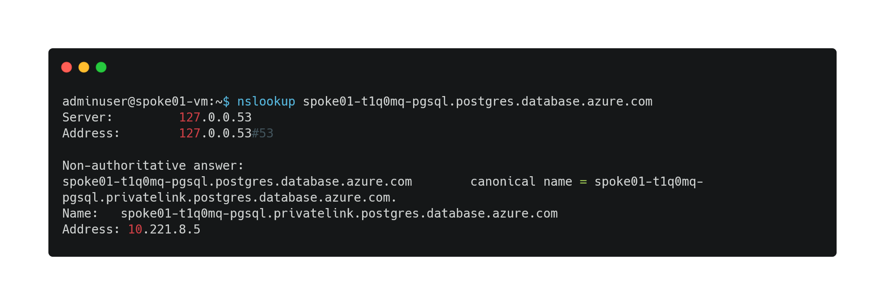

**Nevertheless, *"\*.postgres.database.azure.com"* private DNS resolution is not possible from on-premise network currently and the public IP address associated with the database is returned.**


Let's configure DNS Forwarding Ruleset for both Hub and Onpremise to unlock these capabilities.

## Task 1: Configure Hub DNS Forwarding Ruleset for *contoso.internal* domain

1. In hub-rg, check "Show hidden types" and open Dns Forwarding Ruleset

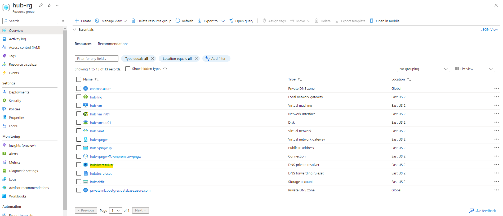

2. Add Forwarding Rule for *contoso.internal.* domain to On-premise DNS inbound IP address: `10.233.2.4:53`

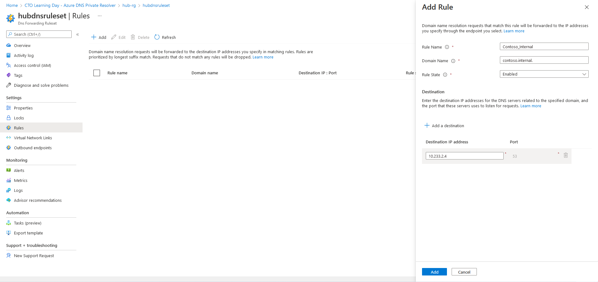


3. Check that now, hub & spokes networks are able to resolve *onpremise-vm.contoso.internal* domain
  
* From hub-vm: 


* From spoke01-vm:
  
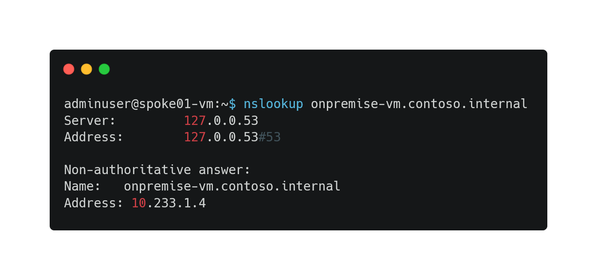

## Task 2: Configure Onpremise DNS Forwarding Ruleset for postgresql domain

1. In onpremise-rg, check "Show hidden types" and open Dns Forwarding Ruleset
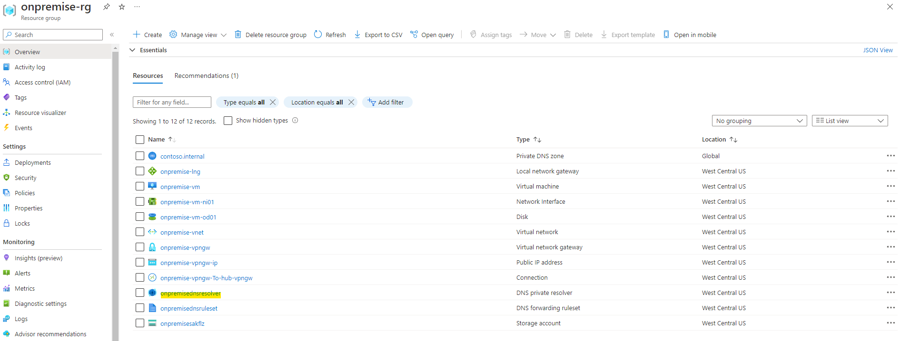

2. Add Forwarding Rule for *privatelink.postgres.database.azure.com.* domain to Azure DNS inbound IP address: `10.221.2.4:53`


  > If you plan to go add other PaaS Services during this MicroHack and want to enable DNS resolution from on-premise, it will be required to add an additional Private DNS zone name. A full list is available [here](https://docs.microsoft.com/en-us/azure/private-link/private-endpoint-dns).

3. Check *spoke01-t1q0mq-pgsql.postgres.database.azure.com* DNS resolution from onpremise-vm

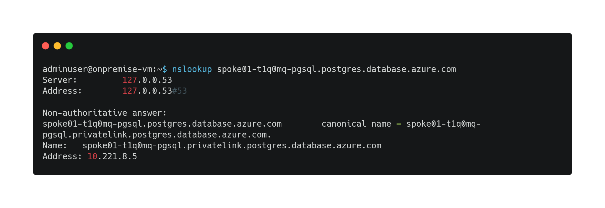

## :checkered_flag: Results

- *\*.contoso.internal* DNS resolution from Azure hub&spokes networks is now possible (in addition of on-premise network):

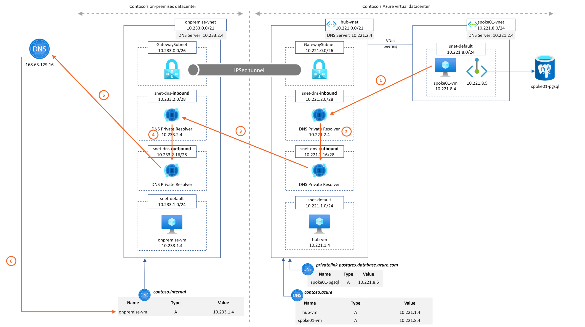

- Privatelink DNS resolution from on-premise network is now possible (in addition of azure hub&spokes networks):


# Challenge 2: DNS forwarding ruleset on spokes

So far, we have configured spoke vnet DNS settings to point to the Azure DNS inbound IP address directly, but there is also a possibility to **rely on the DNS Private resolver solution at the spoke level**. Let's see how.

## Task 1: Reset the DNS settings on the spoke Vnet

On the terraform template we used to build the whole infrastructure, we set the DNS settings of the hub and the spoke Vnets to point to the IP address `10.221.2.4`, which is the Azure DNS inbound IP address (located in the snet-dns-inbound subnet of the hub Vnet).

We will **remove this configuration** and **edit our Vnets** so that they will **now use the default configuration: Default (Azure-provided)**. 

It means that all DNS queries of all Vnets will be sent to the Azure Provided DNS IP [168.63.129.16](https://docs.microsoft.com/en-us/azure/virtual-network/what-is-ip-address-168-63-129-16). 
The default behavior for DNS resolution will be first to look first at:
1. Azure Private DNS zones linked to the Vnet
2. DNS Forwarding Rulesets linked to the Vnet.

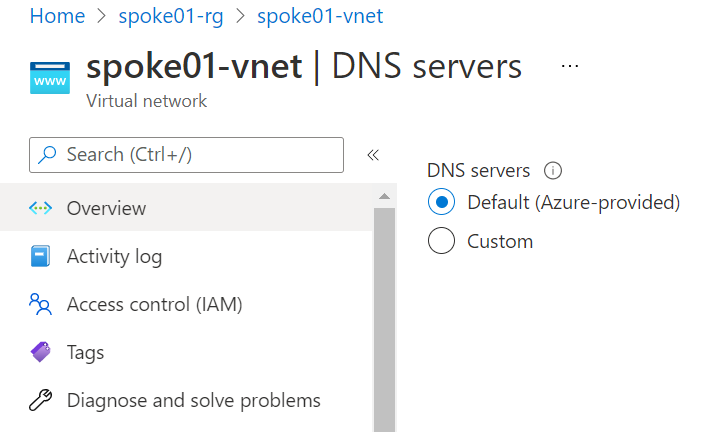

  > :warning: **Do not forget to restart associated VM(s) to refresh their DNS configuration.**

  > DNS server(s) used by Azure virtual machine (VM) comes during VM boot via DHCP. By restarting VMs here, they will pick the new DNS server to use.

## Task 2: Attach the forwarding ruleset

Once the default DNS settings is configured, the next step consists in **linking the Forwarding Ruleset to the spoke Vnet**.

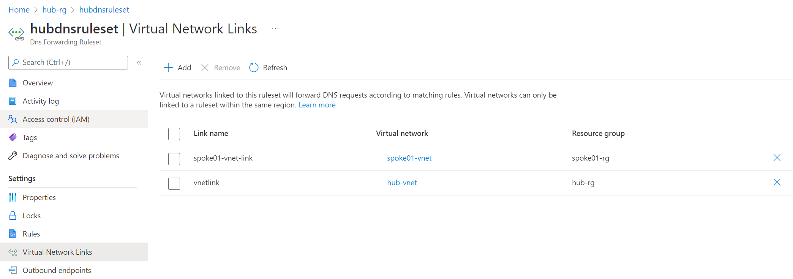


## Task 3

Let's first go back to our last example to understand the resolution path for a DNS query from on premise to a private endpoint.  

Before starting this challenge #2, DNS settings on the spoke Vnet was configured with `10.221.2.4` IP address and no Forwarding Ruleset was attached to this Vnet. So far, the DNS resolution path from the spoke-vm to the PostgreSQL instance was the following:


Now, once Task 1 and Task 2 are accomplished, we rely on the Azure Provided DNS IP for DNS resolution, which will parse first Azure DNS private zones and then Forwarding Ruleset linked to the Vnet. We must then reconfigure the Forwarding Ruleset to explicitly give the DNS servers per domain:


Our design, here, is pretty straightforward as our ruleset consists in:
* Sending the DNS queries for **contoso.internal** to the on-premise private DNS resolver `10.233.2.4`
* Sending the DNS queries for **contoso.azure and privatelink.postgresql.database.azure.com** to the hub private DNS resolver `10.221.2.4`

DNS queries from spoke-vm still work but in a different way. The query path is quite different and the Azure Provided DNS IP becomes even more central in all DNS resolutions. Example again of DNS resolution path from the spoke-vm to the PostgreSQL instance was the following:

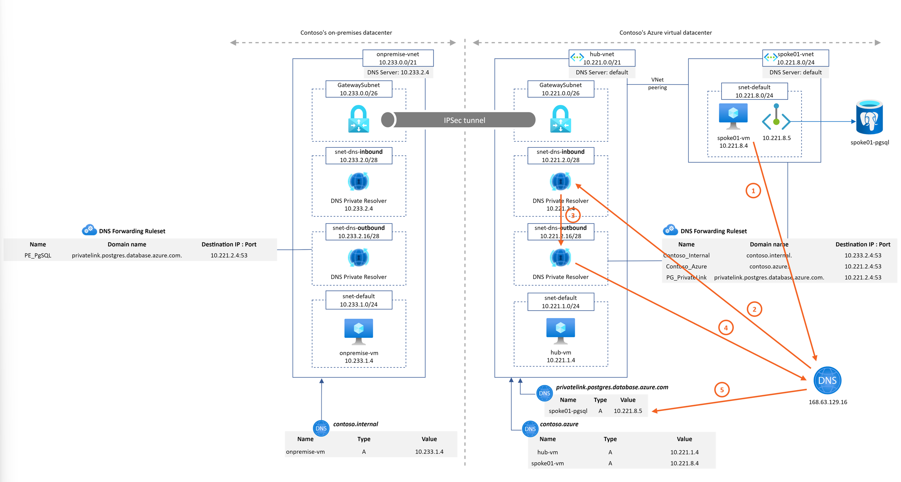

> Another option could have been to link privatelink Azure Private DNS Zone to the spoke Vnet but we recommand to avoid full-mesh links for private DNS zones and to rely on the hub instead. More details [here](https://docs.microsoft.com/en-us/azure/cloud-adoption-framework/ready/azure-best-practices/private-link-and-dns-integration-at-scale).

# Challenge 3: Deploy Azure Firewall to get DNS logs

Azure DNS Private Resolver does not offer today's capabilities to view the logs of DNS requests made.

A solution to have these logs is to deploy Azure Firewall and use it as a DNS proxy:
* Azure Firewall will be configured to act as a DNS Proxy: it will forward all DNS requests to Azure DNS Private Resolver inbound IP address

For DNS settings, the 2 options seen above still apply:
* **Option a:** Hub & Spokes vnets will have their DNS Servers configured with the private IP address of Azure Firewall

* **Option b:** 
  * Spokes vnets will have their DNS Settings configured with Default (Azure-provided)
  * Hub vnet DNS Settings will be configured with the private IP address of Azure Firewall 
  * Forwarding rules will point to the Azure Firewall private IP address

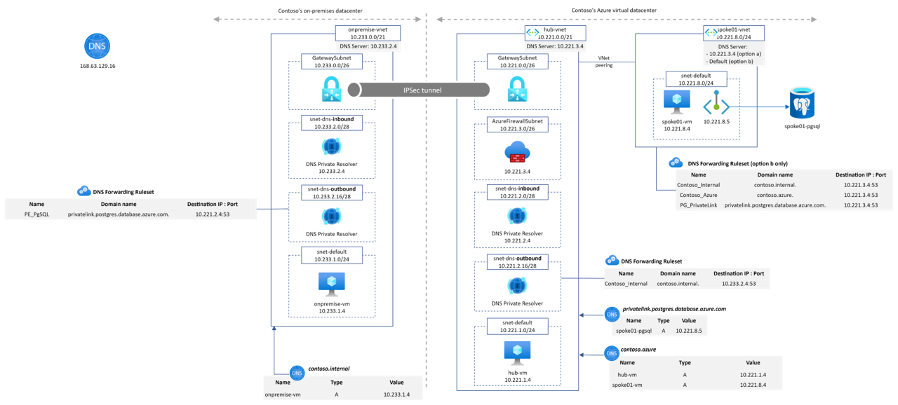

Only Task 3 will vary depending on the option you choose. 

## Task 1: Deploy Azure Firewall

In the Azure Portal, deploy a new Azure Firewall instance in hub-vnet. A subnet named *AzureFirewallSubnet* has already been created for you.

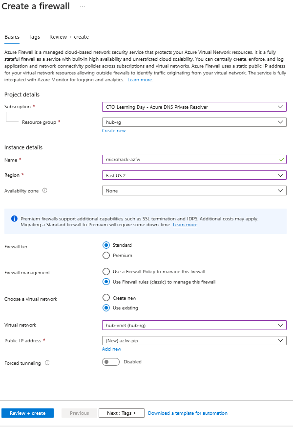

Your Azure Firewall instance will take about 10 minutes to deploy. When the deployment completes, go to the new firewall's overview tile and take note of its *private* IP address. 


## Task 2: Configure Azure Firewall DNS proxy

Configure Azure Firewall as a DNS Proxy:

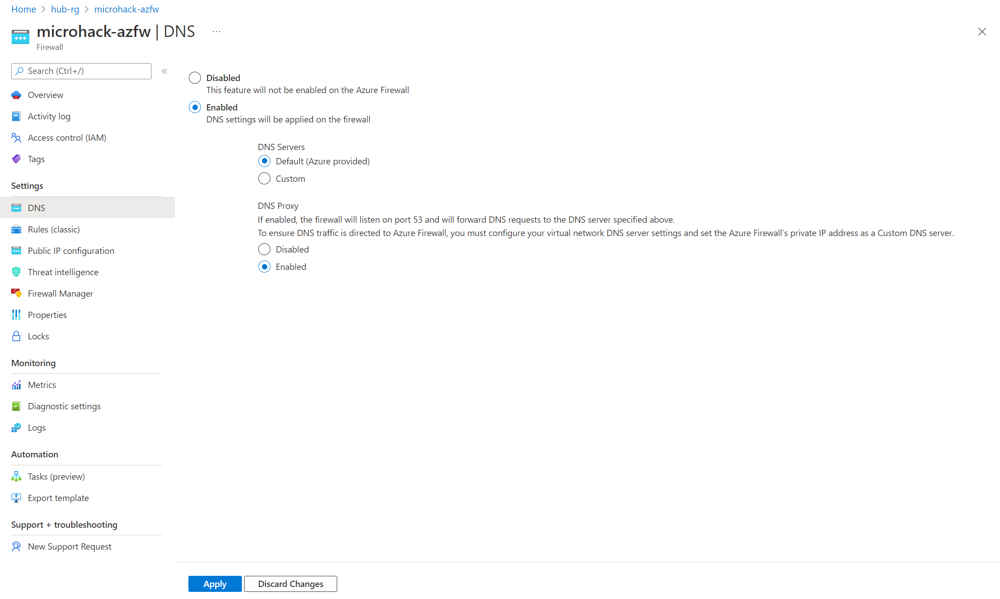

## Option a - Task 3: Update Hub and spokes Vnet DNS Settings

Instead of configuring DNS Private Resolver Inbound IP address as DNS Server for hub-vnet and spoke01-vnet, configure with Azure Firewall private IP address:

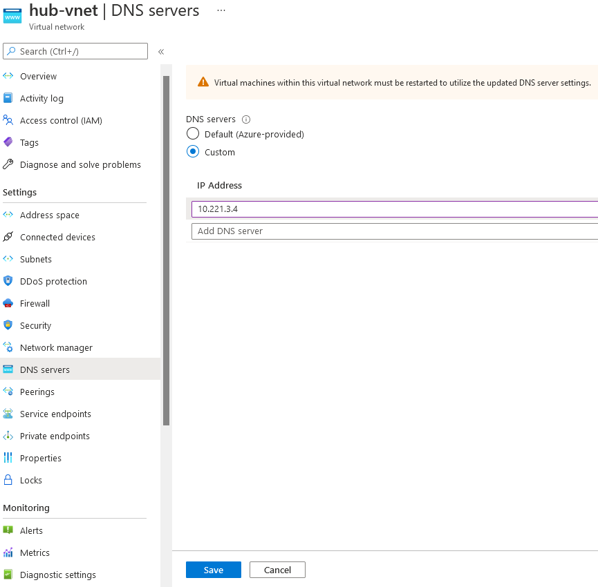

**Do the same for spoke01-vnet**.

  > :warning: **Do not forget to restart hub-vm and spoke01-vm) to refresh their DNS configuration.**

  > DNS server(s) used by Azure virtual machine (VM) comes during VM boot via DHCP. By restarting VMs here, they will pick the new DNS server to use.
  
## Option b - Task 3: Update Azure DNS Forwarding Ruleset

We must rework the current Forwarding Ruleset so that:
- All DNS queries (for all domains) from spokes will be sent to the Azure Firewall private IP
- DNS queries from the hub to *contoso.internal* are sent to `10.233.2.4`

Here is this global architecture redesign

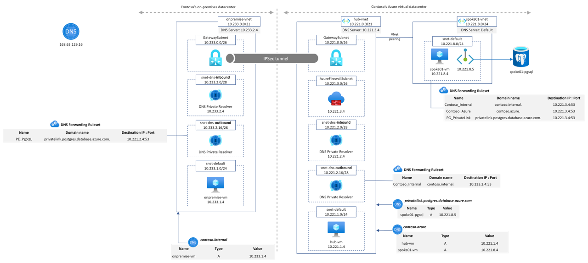

As you can see, we now have 2 different rulesets with different rules: one for the hub and one for the spoke(s):
- Spoke DNS Forwarding Ruleset: make sure that every DNS request coming from the spoke vnets go through the Azure Firewall
- Hub DNS Forwarding Ruleset: as *contoso.azure* and *privatelink.postgresql.database.azure.com* Private DNS zones are already attached to the hub and are resolvable, no forwarding rules are required

We can also notice that the DNS settings for the Hub Vnet is pointing to the IP address of the Azure Firewall instead of *Default (Azure provided)*. From a DNS standpoint, both configurations are valid but the first option has the advantage of sending all DNS queries originating from Hub Vnet into the Azure FW and to being able to see the associated logs.

First, let's remove unnecessary rules from the hub Forwarding Ruleset:


Then, let's link the spoke Forwarding Ruleset (created during setup but not attached to anything so far) to spoke01-vnet:


And finally, complete the rules of this ruleset:


## Task 4: Update Onpremise DNS Forwarding Ruleset

Instead of pointing to DNS Private Resolver Inbound IP address for *\*.postgres.database.azure.com* and *contoso.azure* domains, requests will be forwarded to Azure Firewall private IP address in the hub:

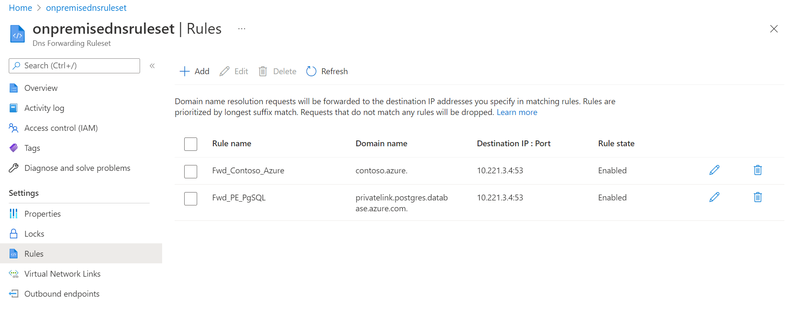

## Task 5: Create a Log Analaytics Workspace and configure Azure Firewall Logs

In hub-rg, create a "networkmonitoring" Log Analytics Workspace:

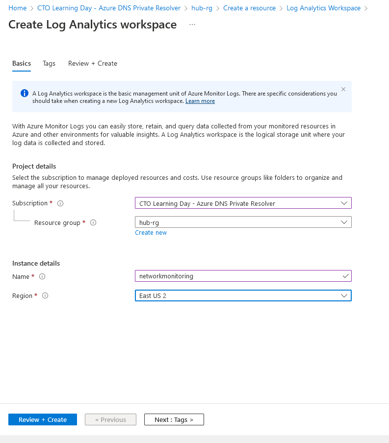

Configure Azure Firewall Diagnostic Settings to send its logs to *networkmonitoring* Log Analytics Workspace:

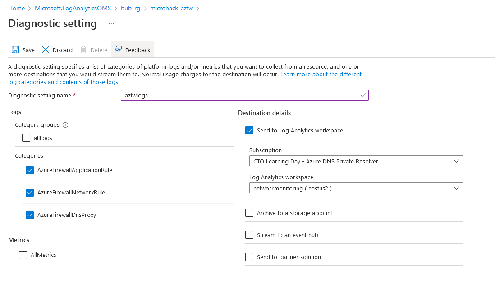
 
  > It can take 10-20 minutes for the logs to appear in the Log Analytics Workspace. Take a ☕!

## Task 6: Generate DNS request from Azure Hub&spokes VM and display logs

* Generate DNS requests from spoke01-vm

* Display Azure Firewall DNS logs using the following KQL query:
```
// Azure Firewall DNS proxy log data 
// Start from this query if you want to understand the Firewall DNS proxy log data. This query will show the last 100 log records but by adding simple filter statements at the end of the query the results can be tweaked. 
// DNS proxy log data 
// Parses the DNS proxy log data. 
AzureDiagnostics
| where Category == "AzureFirewallDnsProxy"
| parse msg_s with "DNS Request: " SourceIP ":" SourcePortInt:int " - " QueryID:int " " RequestType " " RequestClass " " hostname ". " protocol " " details
| extend
    ResponseDuration = extract("[0-9]*.?[0-9]+s$", 0, msg_s),
    SourcePort = tostring(SourcePortInt),
    QueryID =  tostring(QueryID)
| project TimeGenerated,SourceIP,hostname,RequestType,ResponseDuration,details,msg_s
| order by TimeGenerated
| limit 100
```

* Observe DNS queries going through Azure Firewall:


## :checkered_flag: Results

### Option a

- *\*.contoso.internal* DNS resolution from Azure hub&spokes networks is still possible (in addition of on-premise network) but goes through Azure Firewall first:

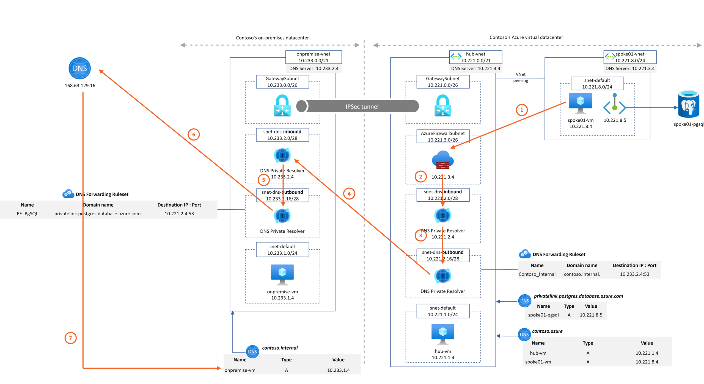

- Privatelink DNS resolution from on-premise network is still possible (in addition of azure hub&spokes networks) but goes through Azure Firewall:

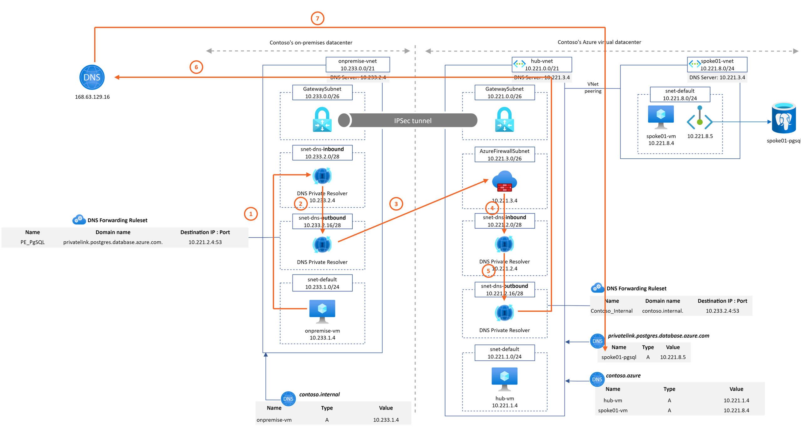

### Option b

- *\*.contoso.internal* DNS resolution from Azure hub&spokes networks is still possible (in addition of on-premise network) but goes through Azure Firewall first:

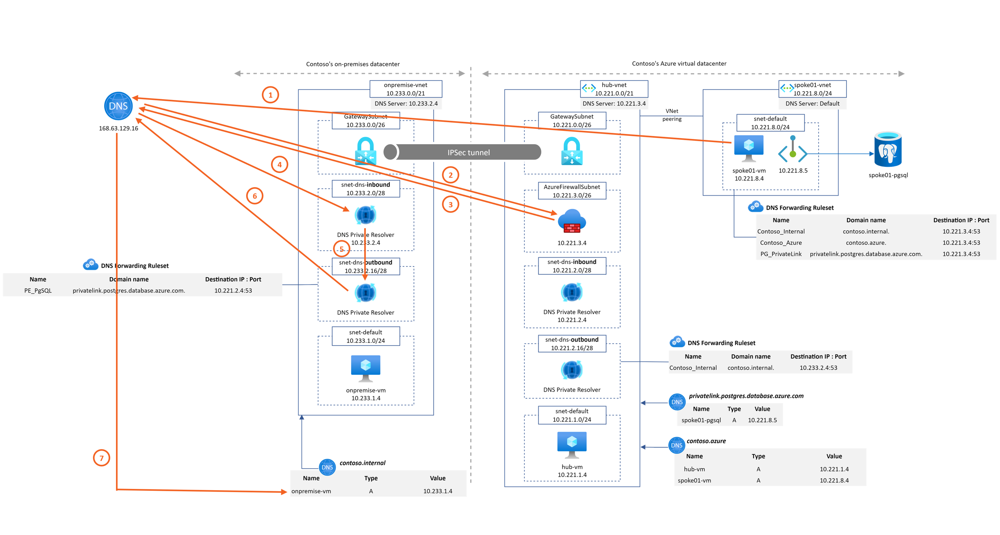

- Privatelink DNS resolution from on-premise network is still possible (in addition of azure hub&spokes networks) but goes through Azure Firewall:


# Finished? Delete your lab

- Delete the resource group onpremise-rg
- Delete the resource group hub-rg
- Delete the resource group spoke01-rg

  > As of now, there is a *bug* where you will not be able to remove vnets that have a vnet link in a DNS Forwarding Ruleset. Please remove Vnet links before removing the resource groups.

Thank you for participating in this MicroHack!

# Credits

This lab is inspired by the [internet-outbound-microhack](https://github.com/fguerri/internet-outbound-microhack) of [Federic Guerrini](https://github.com/fguerri).